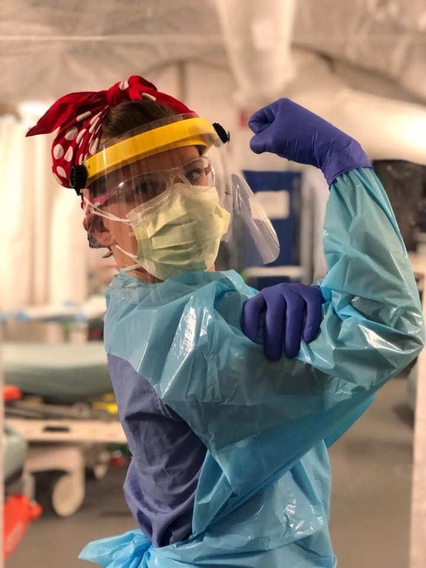

# **Nurse hate threads - "She's not a hero" **

### Background

Since the beginning of the covid-19 pandemic nurses (alongside doctors and other medical workers) have been celebrated around the word for risking their health and working overtime in order to fight the virus. The work done by nurses has been subject to increased attention, which has among other led to a debate on their work conditions and wages. 

The global mainstream celebration of nurses has, however, also provoked hatred and frustration. On the male dominated online imageboard [4chan.org](4chan.org) there has been a rise of discussion threads revolving around hatred against nurses. These threads mostly appear on the board /pol/ ("Politically Incorrect"). Such threads are often referred to as "nurse hate" threads. The vast majority of these discussions combine the hatred against nurses with explicit misogyny; the nurses are mostly incapable, immoral or immature in virtue of being women. Importantly, the characterization of nurses often aims at creating an antithesis to the figure of the hero. Nurses are ridiculed as not skilled, moral, mature, or smart enough to be real heroes. Rather, they are seen as people who exploit the current attention to stage themselves as heroes. 

I will investigate how female nurses are described in online debate in the board /pol/ on 4chan. More concretely, I will look closer at how nurses are negatively defined within this discourse as non-heroes. 

---

**Research question**

How are nurses defined negatively as non-heroes within the discourse of nurse hate threads (/pol/, 4chan)?

**Research object**

Posts about nurses during the pandemic from the board /pol/ on [4chan.org](4chan.org). The posts date from the 25th of January 2020 till 8th of June 2020. This amounts to 116 posts. 

**Empirical source**

A textfile generated by a script that scrapes the text from the 116 posts. 

The content is scraped from the archive for 4chan, [4plebs](https://archive.4plebs.org/pol/search/subject/nurse/start/2020-01-25). [^1]

---

1. One concern is that I extract the content from an archive [4plebs](https://archive.4plebs.org/pol) and not from the page itself. The problem with the original page, however, is that there is so much content generated on 4chan everyday that the posts are normally automatically deleted on the very day they are published. Whereas the archive has saved all posts since April 2013 (see more on "Infos 4plebs.md"). 

 

