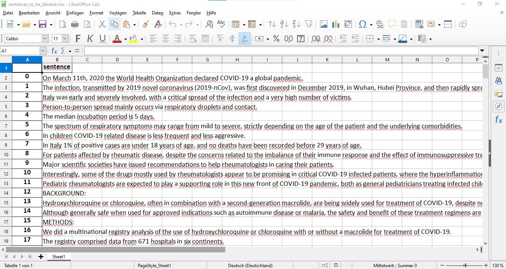
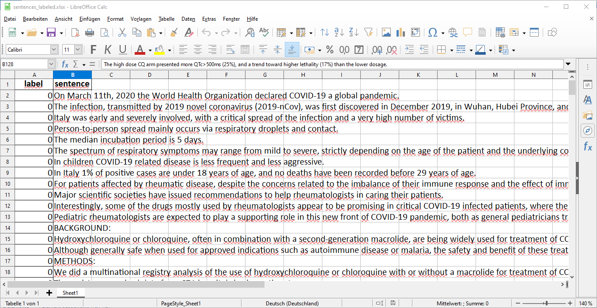

#### PHILOSOPHY AND HISTORY OF SCIENCE WITH COMPUTATIONAL MEANS

##### PROF. DR. GERD GRAßHOFF

This markdown file has to be complemented by the corresponding notebook. It is strongly recommended to read the markdown file alongside the notebook:

* [hcq_2_sentences.ipynb](hcq_2_sentences.ipynb)

For the previous steps see:

* [hcq_1_clean_abstracts.md](hcq_1_clean_abstracts.md) and [hcq_1_clean_abstracts.ipynb](hcq_1_clean_abstracts.ipynb)


# 2 Sentences


## 0 Import Libraries

* We import all required libraries
* `nlp = spacy.load("en_core_web_lg", disable=["ner"])` We create an object called **`nlp`** by means of telling `spacy` to load the language model `"en_core_web_lg"` (that's one of `spacy`'s English language models). If applied to a text-**`string`** the nlp-object does *Natural Language Processing (NLP)* thereby creating a **`Doc`**-object. The text processing is done by several components that constitute a *processing pipeline*. For dividing the text of an abstract into single sentences *Named Entity Recognition (NER)* is not necessary. So we disable the respective pipeline component when loading the language model by setting the parameter ` disable=["ner"]`. This makes our code run faster.

  The processing pipeline consists of these components (at least):

  - **tokenizer**
  - **tagger**
  - **parser**
  - **ner**

  (For further information see: [spaCy: Language Processing Pipelines](https://spacy.io/usage/processing-pipelines).)

## 1 Load Dataframe

* `abstract_df = pd.read_json("../data/HCQ_clean_abstracts.json")`: We load the **`dataframe`** that we have created as in final result in the notebook "hcq_1_clean_abstracts.ipynb" (see also "hcq_1_clean_abstracts.md").  The dataframe is loaded by using the **`function`** `hcq_1_clean_abstracts()` from the `pandas` library. We call the dataframe `abstract_df `.


## 2 New Dataframe: From Abstracts to Sentences

For the current project we are not interested in whole abstracts, but in certain sentences that are part of these abstracts. In this section the abstracts shall be decomposed into their single sentences. We store the sentences in a new dataframe. There shall be only one sentence per row. Furthermore we add the abstract's title from which the sentence is taken and a sentence ID which is construed with the help of the publication ID and a running number that is assigned to the abstracts sentences in order. By title or sentence ID we are able to determine to which abstract a sentence belongs (if this information is of interest for us). With the sentence ID we can uniquely identify a single sentence. Furthermore it allows to reconstruct the order in which some sentences appear in an abstract's text.

* We define a function `single_sentences()` which is applied on a dataframe containing abstracts (strings) and returns a new dataframe that stores per row one single sentence, a unique identifier as well as the corresponding abstract's title (below the code block I will comment the steps of the code):

  ```python
  def single_sentences(dataframe):
      data_list = []
        
      for row_number in dataframe.index:
          sentence_number = 0
          
          for sentence in nlp(dataframe["abstract_clean"].iloc[row_number]).sents:
              
              sentence_id = dataframe["Publication ID"].iloc[row_number] + "-" + 		str(sentence_number)
              
              data_list.append([sentence_id, dataframe["title"].iloc[row_number], sentence.text])
              
              sentence_number += 1
              
      new_dataframe = pd.DataFrame(data_list, columns=["sentence_id", "title", "sentence"])
      
      return new_dataframe
  ```
  * `def single_sentences(dataframe)`: The function takes the name of a dataframe as an argument. It is called on a dataframe.

  * `data_list = []`: At the beginning the empty list `data_list ` is created. It is the base for making the new dataframe. `data_list ` will be filled with several list-objects each of them will constitute a single row in the new dataframe.

  * `for row_number in dataframe.index:`: This sets a first `for`-loop that iterates over the index of row numbers of a dataframe. (That dataframe is specified by the argument if you call the function.) The following code is executed repeatedly for every row number of that index. That means it is executed for every row of the given dataframe.

    Just to get an idea what a dataframe's index looks like take the index of the dataframe `abstract_df` by calling `abstract_df.index`. This yields `Int64Index([0, 1, 2, 3, 4, 5, 6, 7, 8, 9, 10, 11, 12, 13, 14, 15, 16], dtype='int64')`.

    Given a fixed row number the code proceeds as follows (let's assume the number is n):

    * `sentence_number = 0`: We set a counter with initial value "0". We need that number to make the sentence ID.
    * `for sentence in nlp(dataframe["abstract_clean"].iloc[row_number]).sents:`: This sets a  second `for`-loop inside the first one. Since we know the row number is n and the column is specified as `"abstract_clean"` the expression inside the brackets refers to an abstract-string. With `nlp()` this string is processed into a Doc-object. The Doc has an attribute called `sents` which is a bunch of sentences the Doc consists of. (Let's say the sentences are s0 till s5 are the items of `Doc.sents`). The following code is executed repeatedly for each sentence in this bunch of sentences. For a given fixed sentence of `Doc.sents` the following code is executed (let's assume the sentence is s1):
      * `sentence_id = dataframe["Publication ID"].iloc[row_number] + "-" + 		str(sentence_number)`: Knowing that the row number is n and specifying the column of the dataframe as `"Publication ID"` we get a certain publication ID (a string). Using `+` we concatenate that string with `"-"` and the sentence number to a longer string.  `sentence_number` is actually an **`integer`** (or **`int`**). Because Python allows only for concatenating one string with another string we have to convert `sentence_number` into a string. We do this by calling `str()` on `sentence_number`. We call the resulting string `sentence_id`.
      * `data_list.append([sentence_id, dataframe["title"].iloc[row_number], sentence.text])`: We have the `sentence_id` and with `s1.text`(`sentence.text`) we have s1 as a string. With row number n and specifying the column as `"title"` we get a title. We put all three elements (sentence ID, title and sentence-string) into a list. This list will later constitute a row of the new dataframe. With the list-**`method`** `.append()` we add this list to `data_list`.
      * `sentence_number += 1`: This increases the value of the counter ``sentence_number` by one.
      * Now the second `for`-loop will start again with the next sentence in  `Doc.sents` (i. e. s2).
    * If there are no more sentences left in  `Doc.sents` first `for`-loop will start again with the next row number in the index (i. e n+1).

  * When the first `for`-loop has run with the last row number it will stop and the program will go on with: `new_dataframe = pd.DataFrame(data_list, columns=["sentence_id", "title", "sentence"])`. This will make a new dataframe from `data_list` which is now filled with list-objects, each of them will constitute a single row in the new dataframe. To create the dataframe we  call `DataFrame()`. The first argument of that function is `data_list` and as the second parameter `columns` we pass a list of strings (i. e. `["sentence_id", "title", "sentence"]`) that will be the columns names. We call the resulting dataframe `new_dataframe`.

  * `return new_dataframe`: At last the function returns `new_dataframe`.

* `sentences_df = single_sentences(abstract_df)`: We call the function `single_sentences()` on the dataframe `abstract_df`. The resulting dataframe is called `sentences_df`.

* `sentences_df.to_json("../data/HCQ_sentences.json")`: We export the dataframe `sentences_df` as a json-file. We call it `HCQ_sentences.json`and store it in the directora `data`. (See "hcq_1_clean_abstracts.md", §§1 and 5.)


## 3 Labeling Sentences Manually

In this section I am going to export the sentences dataframe `sentences_df` as an Excel spread sheet. I'll use this Excel file to give labels to the sentences according to whether they might play a role in a disagreement that is of interest or whether they do not. Or, to describe it more technically, the label indicates whether the sentences should be found by a program or not. The Excel file serves as a measure to evaluate the search patterns that will be developed in later notebooks. I will assign labels to the sentences per hand.

* `sentences_df = pd.read_json("../data/HCQ_sentences.json")`: This loads the sentences dataframe we saved in a json-file a few lines earlier from that file again.  It is stored in the variable `sentences_df`. This overwrites the former content stored in that variable. (Actually, this whole step is not necessary. I do it though to show that I am working here with the same dataframe as in the later notebooks.)
* `sentences_df["sentence"].to_excel("../labeling/sentences_to_be_labeled.xlsx")`: This saves the the column `sentence` of the dataframe `sentences_df` as an Excel spread sheet. The Excel file is called `sentences_to_be_labeled.xlsx` and it is saved in the directory `labeling`.
  
  - For this step see the youtube video: ["Intro to NLP with spaCy (3): Detecting programming languages | Episode 3: Evaluation"](https://youtu.be/4V0JDdohxAk) 
  
  - **IMPORTANT!**: If you open that Excel spread sheet please make sure to save it with a **different(!)** file name than the name you passed as an argument to the `.to_excel()`-method. Otherwise all labels will be overwritten when running the code of this notebook again!
  
  - Open the file `sentences_to_be_labeled.xlsx`. There are two columns: an unnamed column that is basically `sentences_df`'s index and on the right next to it a column "sentence" which is the column we exported.
  
    *sentences_to_be_labeled.xlsx*
  
  - We call the unnamed column "label" and set all values in that column to "0".
  
    *sentences_labeled.xlsx*
  
  - Then go through all rows: If we hit a sentence that we think our search pattern should find, then we change the value in column "label" to "1" (for that respective row). If we think our search pattern should not detect a sentence, then we leave the value for that sentence in column "label" unchanged (i. e. it remains "0").
  
    *sentences_labeled.xlsx: changing value*
  
  - If not done already save the file and give it a **new** name. (I chose `sentences_labeled.xlsx`).

