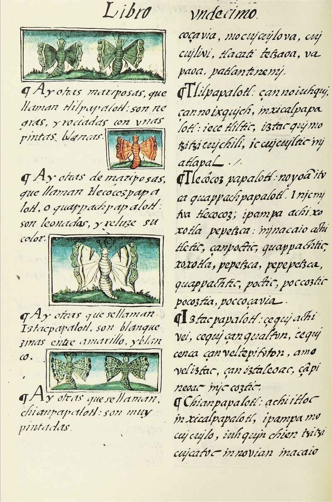
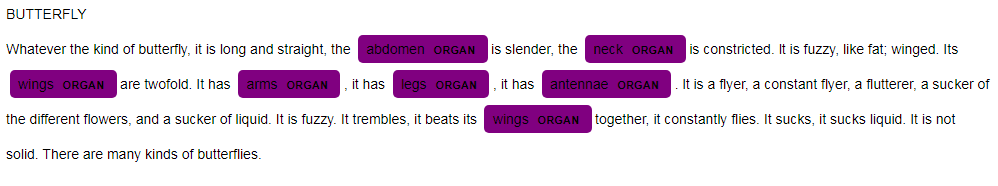
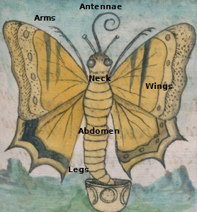

# The Butterflies of the *Florentine Codex*

###### V. Alice. B. Frías

## Background

Almost 2000 years ago, Pliny the Elder was born. He was a Roman scholar who gained importance primarily through the *Naturalis Historia* (AD 77), an encyclopedia on natural history. The extensive work has been preserved in its entirety and is standard Latin literature. The *Naturalis Historia* was widely-read and discussed, and it became the prototype for the literature of the encyclopedic genre in the Middle Ages (Plinius Secundus 2005).

We can see Pliny's influence in the *Florentine Codex* case, named after its place of storage in the *Biblioteca Medicea Laurenziana* in Florence. Pliny inspired Bernadino de Sahagún, as we know that a copy of the *Naturalis Historia* was in the *Colegio de Santa Cruz de Tlatelolco* (Sahagún1999), the oldest European school of higher education in the American continent where the *Florentine Codex* came into being (between 1540-1590).	

Sahagún, a Spanish Franciscan friar, conducted a research study about the Aztec culture with his Nahua students' help, named *Historia General de las Cosas de Nueva España*. The *Florentine Codex* is the best-preserved manuscript of this ethnographic research study. The *Tolosa Manuscript* is another earlier version kept in Madrid. There are two columns; the right column contains the Nahuatl text, and the Spanish text is on the left. In his ethnographic research, Sahagún obtained the assistance of two critical indigenous groups: the wise elders of numerous cities in central Mexico and the Nahua students. The *Florentine Codex* covers the most diverse aspects of the Aztec society, e.g., history, religion, and medical knowledge; it consists of twelve books.

There is no doubt that the *Florentine Codex* is one of the most remarkable manuscripts created in the early modern era. We can consider it as a variant of the Latin history of science. Due to its context, the difficulty arises when defining a historical tradition. Still, there is an ongoing debate if Sahagún's work belongs to the encyclopedic medieval tradition. Considering Pliny's influence over the concept of encyclopedia and Sahagún's partnership with Nahua men, the *Florentine Codex* exhibits a mixture of European and Mesoamerican traditions.

#### Empirical Source

As this project was the work of one seminar ("Philosophy and history of Science with computational means" given by Professor Graßhoff), I only focused on a brief section of the *Florentine Codex*. This project's source is [Earthly Things](https://www.wdl.org/en/item/10622/view/1/200/), the penultimate book, and mainly, the goal is to analyze the butterflies' statements in the *Florentine Codex*. 

##### Book XI: Earthly Things

Book XI, the longest in the codex, is a treatise on natural history. Following the traditional division of common knowledge in many European works, the *Florentine Codex* deals with everything divine, human, and natural of New Spain. Therefore, after having spoken of superior beings and human beings, Sahagún examines animals, plants, and all types of minerals.

#### Research Object

Even if there are 1.7 million native speakers of Nahuatl, we still cannot find the Aztecs' language in all 61 languages available in spaCy. That is why we used the English translation by Dibble and Anderson of the butterflies' text on fo. 100f.

#### Research Question

This project has the following research question (to state what belongs to the European tradition and what belongs to the Mesoamerican tradition): What are the typical statements about butterflies in the *Florentine Codex*?

#### Aztec Classification of Animals

Sahagún organized the work in two columns: on the right is the original text in Nahuatl, and on the left, Sahagún's free translation into Spanish. 

"Papalotl" means "butterfly," and as we can appreciate from the example, there are different words that contain the name "papalotl": 

1. Tlilpapalotl (black-butterfly)
2. Tlecôzpapalotl (will-go-up-butterfly)
3. Iztapapalotl (white-butterfly)
4. Chianpapalotl (chia-seeds-butterfly)
5. Xicalpapalotl (gourd-butterfly)
6. Texopapalotl (blue-butterfly)
7. Xochipapalotl (flower-butterfly)
8. Vappapalotl (foliage-butterfly)

In this example, "papalotl" is the general term, and the eight kinds of butterflies registered are specific terms.

#### Method

We will find out the Mesoamerican and European influence by extracting the Mesoamerican thought of the *Florentine Codex* and separating it from the European tradition. Comparing the *Florentine Codex* with the *Naturalis Historia* and other possible European works, it is possible to determine the European tradition. Besides, analyzing the Nahuatl gives us a hint of what belongs to the Mesoamerican tradition in the *Florentine Codex*. In the digital age, we have powerful computing technologies to collect data and process it methodically. We encounter natural language processing (NLP) results in our everyday lives, like machine translators, spell checking, virtual assistants, chatbots, sentiment analysis, and advertisement matching. NLP is an interdisciplinary field of computer science and linguistics that aims to interact between computers and humans to process human language, read and understand the natural language, structure the input, evaluate and interpret the output. An essential tool for this research will be spaCy, an open-source software library for NLP (Honnibala and Montani 2020).

1. To import the text.
2. To tokenize into sentences.
3. To create a Data Frame.
4. To train the category 'ORGAN.'
5. To visualize the newly named entity.
6. To search for the most frequent words, verbs, and adjectives.

#### So far accomplished 

We successfully imported all the needed libraries (pandas, re, spaCy, PhraseMatcher, Matcher, displaCy, span). Then, we prepared a TXT file and read it into the Jupyter Notebook. The next steps were to split the text into sentences and to clean up the newlines. We present the sentences in a Data Frame. Next, we loaded the English model, and we make a 'doc.' With the Phrase Matcher, we found the mentioned organs of the butterflies:

- abdomen
- neck
- wings
- arms
- legs
- antennae

We check where they span and add them to spaCy generating the label 'ORGAN.' A function helps to see if it worked. With displaCy, we rendered the result.

#### Results

After some statistical functions, we found the typical verbs and adjectives used to describe the butterflies.

What do butterflies do according to the Aztec conception? 

- fly
- suck
- become
- develop
- turn
- glow
- glisten
- tremble

What are the descriptions used to characterize the butterflies in the *Florentine Codex*?

- twofold
- fuzzy
- whitish
- pale
- light-blue
- blue-brown
- fire-yellow
- flower-like
- beautiful
- desirable
- truly wonderful
- with a chia design
- of very intricate design

Which were the most frequent words? 

- yellow
- painted
- wings
- smoky
- constantly
- blue
- varicolored
- large

Other related nouns?

- size
- colors
- liquid
- hue
- flutterer

#### What could be improved?

1. We added the category of the organs manually. It would better to use "prodigy" to train the model, but I am still working on it.
2. All the other named entities I omitted because spaCy miscategorized some words. 
3. Apply this method to all the rest of the animals of the *Florentine Codex*.

## Conclusion

Pliny does not mention butterflies in his "Zoology." He only mentions bees, wasps, hornets, spiders, scorpions, cicadas, grasshoppers, and ants. We can conclude that the information about butterflies in the *Florentine Codex* is authentic to the Aztec classification. The *Florentine Codex* structure was European. Sahagún wrote a questionnaire; thus, he was the one who asked the questions and structured the work. It is European to create an encyclopedia organized with descending order topics, from the higher to the lower category, so that the first part deals with the gods and the upper world and finally the description of the so-called earthly things. That is why the outcome is a work that is very similar to European encyclopedias.

Nevertheless, the content was more Aztec. In the butterflies' instance, we can read a description of the character traits, appearance, and skills. We also find about the food of the butterflies. However, we do not find any folk story nor about customs, as in many other animals.

The Aztecs identified six organs of the butterflies, according to the *Florentine Codex*. Although they included the legs, we can't see them in the drawing. Furthermore, they drew the proboscis but did not mention it in the text. They denominate the organs in the first paragraph and tell us that butterflies continuously fly and suck the flowers' liquid. 

The next sections give details about the different kinds of butterflies, introducing all the different names and always differentiating between colors to name the different butterflies. Sahagún and his scholars refer to the change of tone of color that some butterflies show. Some kinds of butterflies have different sizes. They also give an account of the patterns of the wings. There are sentences about butterflies on the *Florentine Codex* that express that the Aztec thought these insects were beautiful. Finally, we can conclude that most of the sentences tell us how the butterflies are. The rest of the sentences are about the actions of the butterflies.

There are eight subcategories of the butterfly. Below we can see the essential characteristics of the kinds of butterflies.

1. Tlilpapalotl: black flecked with white
2. Tlecôzpapalotl: fire-yellow, it turns smoky yellow
3. Iztacpapalotl: different sizes, white
4. Chianpapalotl: chia design
5. Xicalpapalotl: large, yellow, it becomes varicolored
6. Texopapalotl: large and tiny, a light blue hue, it becomes blue-brown
7. Xochipapalotl: large and small, varicolored, intricate design
8. Vappapalotl: average size, chili-red

## References

Honnibala, Matthew, and Ines Montani. 2020. "spaCy." Berlin, Germany: ExplosionAI GmbH. 2020. https://spacy.io/. 

Plinius Secundus, Gaius. 2005. Naturkunde. Edited by Marion Giebel. Vol. I–V. Stuttgart: Reclam. 

Sahagún, Bernardino de. 1999. *Historia General de Las Cosas de La Nueva España*. Edited by Ángel María Garibay K. Editorial Porrúa. 

———. 2012. *Florentine Codex: General History of the Things of New Spain: Book11 -Earthly Things*. Translated by Charles E. Dibble and Arthur J. O. Anderson. 2. ed. Salt Lake City: The School of American Research; the University of Utah, p. 94f.

———. 2014. "General History of the Things of New Spain by Fray Bernardino de Sahagún: The Florentine Codex. Book XI: Natural Things." World Digital Library, p. 200ff.0ff.