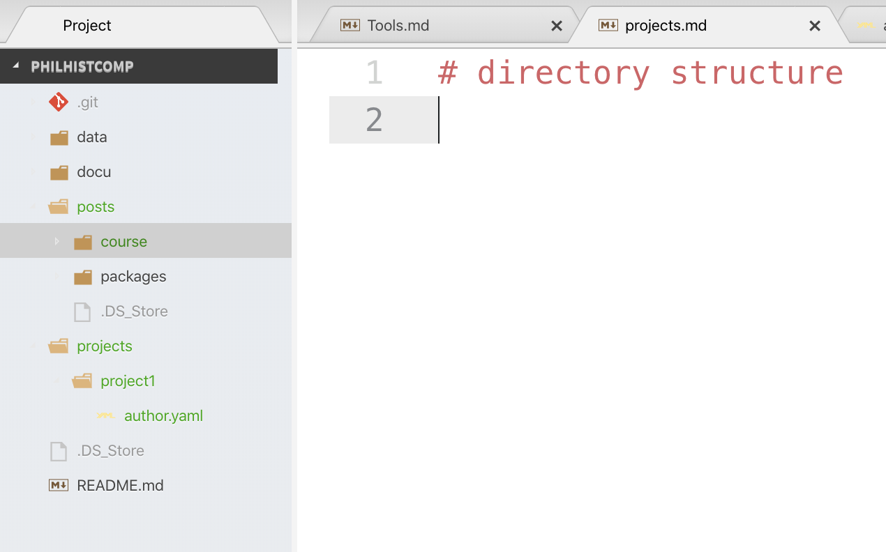

# directory structure

# Materials for individual seminar conferences

## June 4th, 2020

- Goals
  - Starting the Jupyter Lab working environment
  - Structure of the page
    - In the sense of "literate programming" (Donald Knuth)
    - Explanatory narrative text
    - Comprehensible part of the program by others
  - Rules of construction
    - Not too lengthy notebooks, few tasks
    - only required textual explanations
  - Hilfe/Tutorials/Info jeder Art
  - Project considerations
  - Title and description of the task
  - Programmes
    - Import of libraries
    - Import of sources, raw data
    - Data wrangling: generating research data
- Jupyterlab
  - Title, Task
  - import
  - Importing Sources
  - research data
  - Define functions
  - Pandas Functions
    - read
    - .head()
    - Copy, slice
    - Filtering of subsets
    - Suchen mit regulären Ausdrücken
    - Ähnliche Ausdrücke (fuzzy)
- Spacy und die Kunst der linguistischen Analyse
  - 2 Zeilen zum Einrichten
  - Von Text zu Doc
  - Was sind und können Docs
  - Spacy Tutorials 
