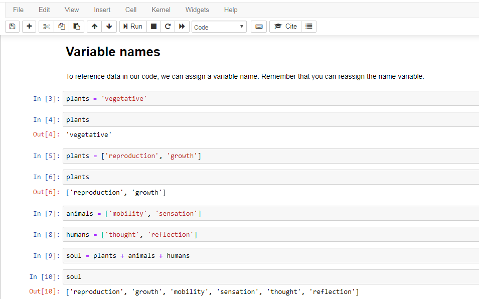

#### PHILOSOPHY AND HISTORY OF SCIENCE WITH COMPUTATIONAL MEANS

##### PROF. DR. GERD GRAßHOFF 


# Some Python Data Types

| Name         | Category | Type    | Description                             | Example                 |
| ------------ | -------- | ------- | --------------------------------------- | ----------------------- |
| Strings      | Text     | str     | Ordered sequences of data               | "Hello"    'Hi'         |
| Integers     | Numeric  | int     | Positive or negative whole numbers      | -10          600        |
| Float        | Numeric  | float   | Numbers with a decimal point            | 5.7            8.0      |
| Complex      | Numeric  | complex | Numbers with an imaginary component     | z              x+y      |
| Lists        | Sequence | list    | Ordered sequence of objects             | ["yes","ja","oui","sí"] |
| Tuples       | Sequence | tuple   | Immutable sequence of objects           | ("Ok", 3.14, 42)        |
| Dictionaries | Mapping  | dict    | Unordered collection of key:value pairs | {'name': 'Lucy'}        |
| Sets         | Set      | set     | Unordered collection of unique objects  | {"a","b",'c','d'}       |
| Booleans     | Boolean  | bool    | Logical value                           | True, False             |


# Variable Assigments

You can find out the type of variable using the following built-in function:

```
type(x)
```

- We can assign the data types to a variable name.

- - Take into account that names cannot start with a number; there can be no spaces or symbols (but you can use an underscore).
  - Typically, we use lowercase letters for variable names.
  - Avoid names that have a special meaning in Python, for example, 'str' or 'int.' These words will have a different color syntax highlighting that will alert you. 

- In Python, it is possible to reassign a variable name to a different data type (in other languages, it would produce an error).

  ```
  soul = 3
  soul = ['vegetative', 'sensitive', 'rational']bb
  ```



