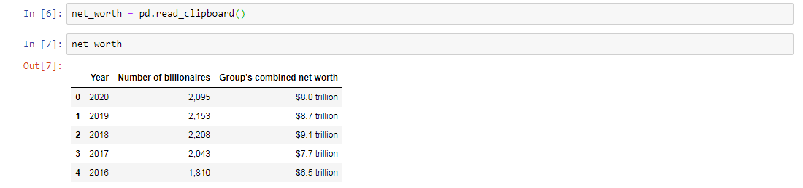

#### PHILOSOPHY AND HISTORY OF SCIENCE WITH COMPUTATIONAL MEANS

##### PROF. DR. GERD GRAßHOFF 


# Introduction to Pandas

We start by importing NumPy, which is the fundamental package for scientific computing. Then we import Pandas so that we can create Series and DataFrames (think of them as spreadsheets). So that we do not have to write each time "Series." and "pandas.DataFrame" we also import Series and DataFrame.


Note that each value is indexed. We can change the index name (creating another series), and we can select series values.


## To create a DataFrame from scratch

The number points of each list must match (each column must have the same number of rows).


Description: ChooseName equal to open curly braces in quotes NameFirstColumn colon open square brackets  in quotes the list of the names of the rows separated with a comma close square brackets comma in quotes NameSecondColumn colon open square brackets in quotes the list of the names of the rows separated with a comma close square brackets close curly braces.


## To grab a DataFrame from a web page

1. You have to import webbrowser

2. Then create a name (in this case it was "website") equal to and in quotes your link

3. Use the function webbrowser.open(your_name)

4. Press Shift-Enter and the web page will open

    

5. Copy the frame (a table with rows and columns): highlight them and select Copy

    

6. Choose another name for the DataFrame (in this case it was "net_worth") equal to pd.read_clipboard()

7. Press Shift-Enter to run the cell, write your chosen name and run the cell again.

   


## Other functions

- To see the columns

  ```
  NameOfDataFrame.columns
  ```

- To create DataFrame with selected columns

  

- To get the first or the last row. If you want the first or last two, change the number 1 to 2 and so on

  

- To get a specific row, for example, the first one:

  ```
  NameOfDataFrame.ix[0]
  ```

  - 0 for the first row, 1 for the second, 2 for the third one and so on

- To see all the functions check the documentation:

  - https://pandas.pydata.org/pandas-docs/stable/reference/api/pandas.DataFrame.html

    

## Important to note

- In Python, indexing starts at 0. 

  ```
  Character: S c i e n c e
  Index: 	   0 1 2 3 4 5 6
  ```

- To show a pop up of the methods on an object press on Tab

- To show help pop up for docstring press Shift-Tab

- To ignore code, put a hashtag at the beginning (in Code cell):

  ```
  # print("This will be ignored because of the hashtag")
  ```

- To comment, change to a Markdown cell

- We can mix single and double quotes, so that Python does not get confused:

  ```
  "I know that I don't know"
  ```

- 