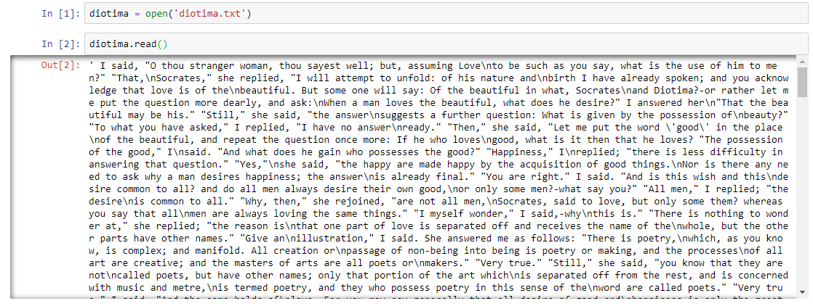
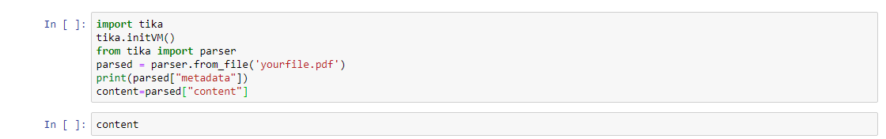

#### PHILOSOPHY AND HISTORY OF SCIENCE WITH COMPUTATIONAL MEANS

##### PROF. DR. GERD GRAßHOFF 


# Reading file formats

To read a text file (.txt) save it in the directory of the notebook, choose a variable, equal to open('nameofyourfiel.txt'), then as follows: nameofvariable.read() use the function to read the text.



To read text files of other formats, copy the following in a cell and replace the name of your file, which you must save there where you save the notebooks. You can replace "content" with another word, but to show the text, you must repeat this name in another cell and, of course, run the cells.




## CSV-File

You have to get or make a CSV-File. Open up any text editor and enter your values all separated by commas. Save it as a CSV-File in the directory where your notebooks are saved.


Use the function and run the cell: 

```
name_DataFrame = pd.read_csv('nameOfYourFile.csv')
name_DataFrame
```


## JSON

- Here is an example:


- Do not forget to import the json module:

```
import json
```

- With the following you can load json data:

```
choose_name = json.loads(name_of_your_json_obj)
```

- With the following you can open JSON data after loading with a DataFrame:

```
choose_another_name = DataFrame(choose_name)
```


- To show the DataFrame, write again your chosen name of the variable and run the cell.
