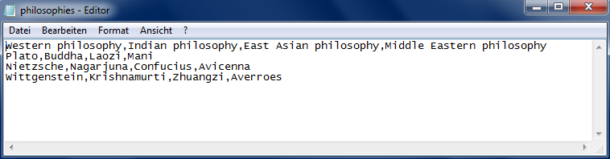
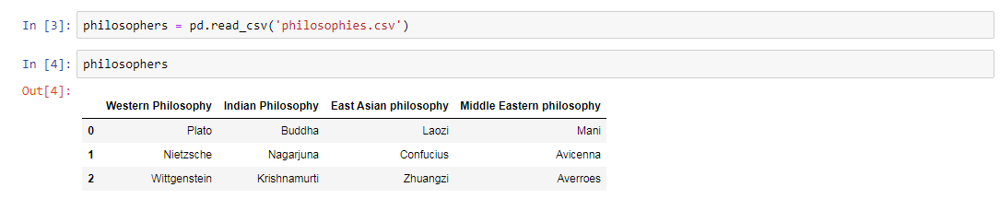
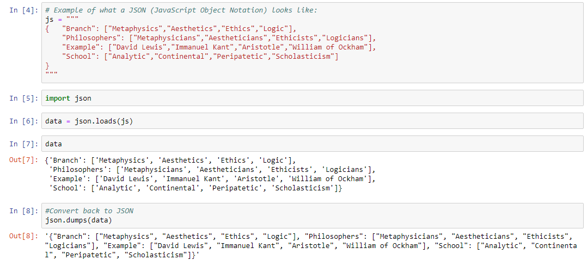
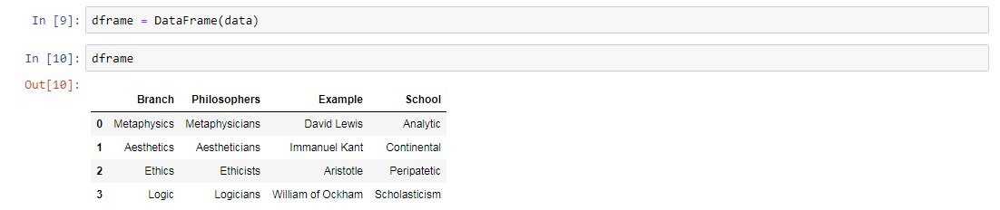

#### PHILOSOPHY AND HISTORY OF SCIENCE WITH COMPUTATIONAL MEANS

##### PROF. DR. GERD GRAßHOFF 


# Reading file formats

First, import NumPy and Pandas as it is the convention:

```
import numpy as np
import pandas as pd

from pandas import Series, DataFrame
```


## CSV-File

You have to get or make a CSV-File. Open up any text editor and enter your values all separated by commas. Save it as a CSV-File in the directory where your notebooks are saved.



Use the function and run the cell: 

```
name_DataFrame = pd.read_csv('nameOfYourFile.csv')
name_DataFrame
```




## JSON

- Here is an example:



- Do not forget to import the json module:

```
import json
```

- With the following you can load json data:

```
choose_name = json.loads(name_of_your_json_obj)
```

- With the following you can open JSON data after loading with a DataFrame:

```
choose_another_name = DataFrame(choose_name)
```



- To show the DataFrame, write again your chosen name of the variable and run the cell.
