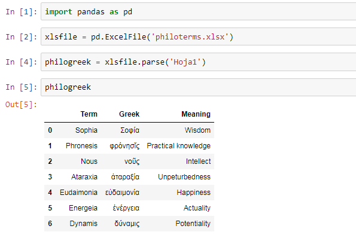

#### PHILOSOPHY AND HISTORY OF SCIENCE WITH COMPUTATIONAL MEANS

##### PROF. DR. GERD GRAßHOFF 


# Excel files with Python

- Save the Excel file in the directory where you store your notebooks.
- Start with the usual convention:

```
import pandas as pd
```

- Choose a variable, in the example we have "xlsfile", equal to the function pd.ExcelFile('nameofyourfile.xlsx')
- Choose another variable, equal to xlsfile.parse('nameofyousheet')
- To show the DataFrame, write the second variable again and run the cells.



