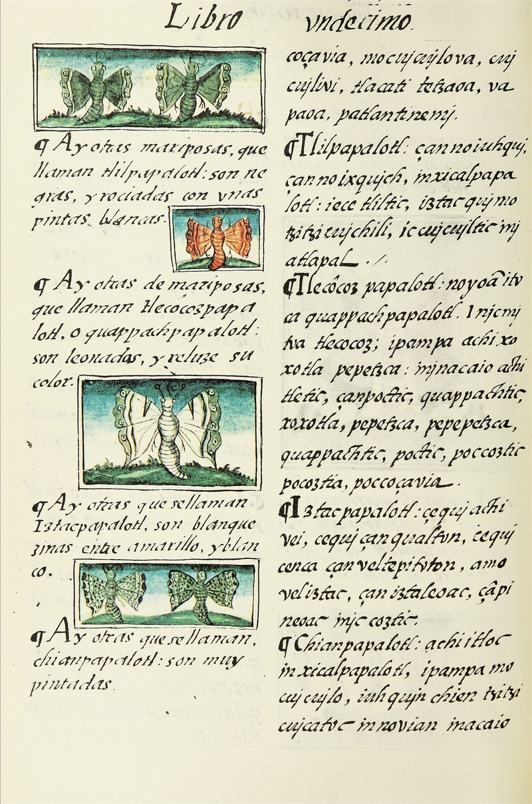

# Florentine Codex

In his ethnographic research, Bernardino de Sahagún obtained the help of two critical indigenous groups: the wise elders of numerous cities in central Mexico and the Nahua students of the Colegio de Santa Cruz de Tlatelolco (which was the first European school of higher learning in the Americas)

The Florentine Codex covers the most diverse aspects of the Aztec society, e.g., history, religion, and medical knowledge; it consists of twelve books.

## Book XI: Earthly Things

Book XI, the longest in the codex, is a treatise on natural history. Following the traditional division of common knowledge in many European works, the Florentine Codex deals with everything divine, human, and natural of New Spain. Therefore, after having spoken of superior beings and human beings, Sahagún examines animals, plants, and all types of minerals.

### Aztec Classification of Animals

Sahagún organized the work in two columns: on the right is the original text in Nahuatl and on the left, Sahagún's free translation into Spanish. 

"Papalotl" means "butterfly" and as we can appreciate from the example, there are different words that contain the word "papalotl": 

1. Tlilpapalotl (black-butterfly)
2. Tlecôzpapalotl (will-go-up-butterfly)
3. Iztacpapalotl (white-butterfly)
4. Chianpapalotl (chia-seeds-butterfly)
5. Xicalpapalotl (gourd-butterfly)
6. Texopapalotl (blue-butterfly)
7. Xochipapalotl (flower-butterfly)
8. Vappapalotl (foliage-butterfly)

In this example, "papalotl" is the general term, and the eight kinds of butterflies registered are specific terms.

#### Research Object

The English translation by Dibble and Anderson of the text of the butterflies on fo. 100f.

#### Empirical Source

The source of this project is [Earthly Things](https://www.wdl.org/en/item/10622/view/1/200/), the penultimate book, and mainly, the goal is to analyze the butterflies' statements in the Florentine Codex. 

#### Research Question

What are the typical statements about butterflies in the Florentine Codex?

## References

Sahagún, Bernardino de. _General History of the Things of New Spain by Fray Bernardino de Sahagún: The Florentine Codex. Book XI: Natural Things_. World Digital Library, June 2014, p. 200ff.

Sahagún, Bernardino de. _Florentine Codex: General History of the Things of New Spain: Book 11 - Earthly
Things_. Translated by Charles E. Dibble and Arthur J. O. Anderson. Salt Lake City: The School of
American Research; the University of Utah, 2012, p. 94f.

