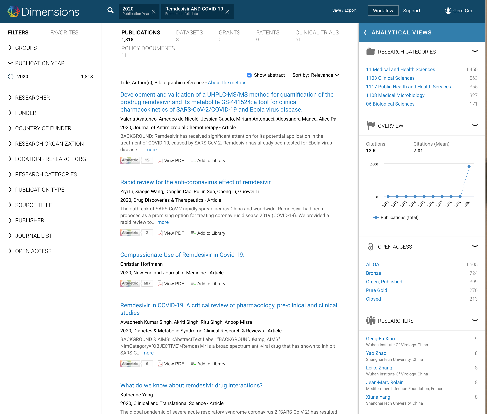
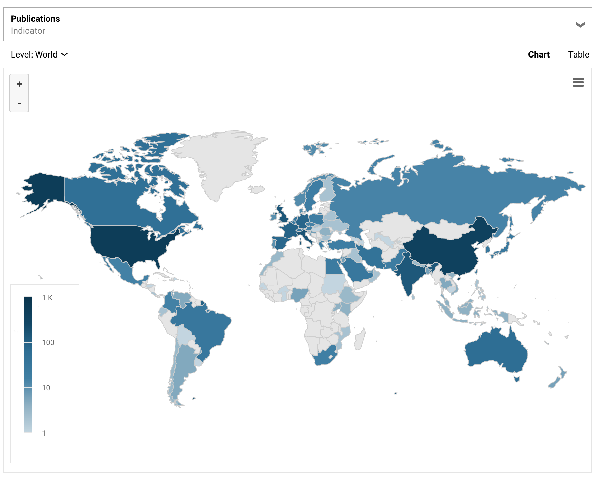

# Subject

This is a selected research question of ongoing publications on corona research.

Early in the debate about drugs against corona virus played a prominent role. It is scientifically established that it is not directly affecting the virus. This study aims to analyse the methodological issues of the dynamics of scientific understanding of the causal effects that the drug creates according to the global set of scientific publications on remdesivir

## Press Conference on Remdesivir at 29th April 2020
[CNN White House Press confernce](https://edition.cnn.com/2020/04/29/health/gilead-sciences-remdesivir-covid-19-treatment/index.html)

# Research objects

## **research objects** = Abstracts of all scientific publications since January 2020 about the possible treatment for coronavirus with remdesivir.

## **empirical sources** = [Data Dimension](https://app.dimensions.ai/discover/publication?search_text=%222019-nCoV%22%20OR%20%22COVID-19%22%20OR%20%E2%80%9CSARS-CoV-2%E2%80%9D%20OR%20((%22coronavirus%22%20%20OR%20%22corona%20virus%22)%20AND%20(Wuhan%20OR%20China))&search_type=kws&search_field=full_search&and_facet_year=2020)

## **research question** = Chronology of causal hypotheses on the effects of Remdesivir and the evolution of their empirical justification.

# References, appendix, ressources

- Covid-19 knowledge tree: https://github.com/covid-19-net/covid-19-community/

- Covid-19 Case Counts from Johns Hopkins University
  - https://github.com/covid-19-net/covid-19-community/blob/master/notebooks/02a-JHUCases.ipynb

- UN Regions
  - https://github.com/covid-19-net/covid-19-community/blob/master/notebooks/00k-UNRegion.ipynb
