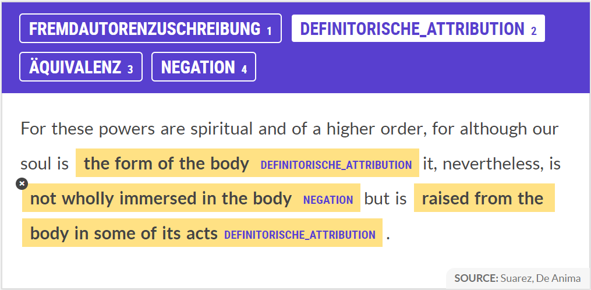
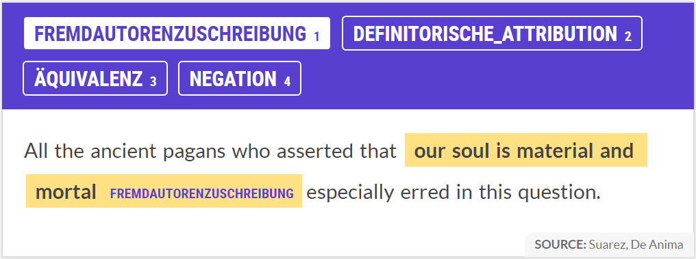

# New Era, New Ideas? Conceptual Continuity between Medieval and Early Modern Philosophy: Initiating a Computational Approach to the History of Ideas (working title)

## Background

Descartes is commonly conceived as the founding father of modern philosophy, a new era in the history of philosophy which put an end to the scholastic tradition of medieval thinkers. This view, however, has recently been challenged by Dominik Perler who claims that in spite of Descartes' attempt to overcome scholastic theories of mind such as Francisco Suárez's account, he nevertheless remains in the medieval paradigm. This is because, according to Perler, Descartes' seemingly new approach to the theory of mind does in fact draw (implicity, or rather: is influenced by) on the work of William of Ockham, i.e. yet another medieval scholar.

As a consequence, this assumption gives rise to a much more continuous, and thus more differentiated, perspective on the history of philosophy by devaluating the role usually attributed to the 'great thinkers' such as Descartes. In other words, it opens up the possibility to rethink the history of philosophy by considering Descartes only as one - nonetheless highly important - contributer to the *progressive* development from medieval to early modern philosophy. According to this view, the line should not be drawn between medieval and early modern debates, but rahter between various competing conceptual approaches originating from the medieval era which were still the subject of philosophical discussion in the early modern period.

 *Fig.1*: Laurentius de Voltolina, *Liber ethicorum des Henricus de Alemannia*, second half of 14th century.

## The Idea

The present investigation aims at re-evaluating the role of Descartes' work in the transition from scholasticism to modern philosophy by applying computational means to the field of the history of ideas. To do so, texts from Descartes, Ockham and Suárez are going to be compared with respect to their degree of conceptual similarity, i.e. the way certain philosophical key concepts are characterised throughout their writings, in particular (but maybe not exlusively) the concept of faculty and/or soul. The analysis thus amounts to an empirical verification of Perler's argument according to which Descartes' thinking is still heavily influenced by the scholastic tradition - a claim that ultimately casts doubt on the dominant view of the French philosopher as the founding father of modern philosophy.

But the historical line drawn between medieval and early modern philosophy is only one example of the historians' tendency to divide the continuous development of philosophical thinking into distinct periods, each of them having a definite beginning and ending. The present investigation on the yet unexplored potential of what current advancements in the field of natural language processing can contribute to historical questions in philosophy is thus at the same time intended to provide a new method which offers a novel perspective on the history of ideas. Hence, future research could apply the method developed in here to other distinctions in the history of philosophy and thereby contribute to the emergence of a (fairly?) new field of research at the intersection of philosophy and computer science, i.e. to a computational approach to the history of philosophy.

## Research Question

The principal question which led to the present investigation can be summarised as follows: if different philosophical traditions (or eras) are distinguishable by the way their respective main protagonists characterise the most important key concepts, then does a large-scale (computational) semantic anaylsis of the concepts used at different points in the history of philosophy lead to the discovery of new connections which force us into giving up long established distinctions?

With respect to the distinction between medieval and early modern philosophy, the idea is thus to take into account all the relevant writings of Ockham, Suárez, and Descartes. After all the passages in which the authors mention the key concept(s) in question have been identified and isolated, a SpaCy model specifically trained for this purpose will categorise those propositions according to the different ways in which the authors characterise the concept(s) - such as Fremdautorenzuschreibung, definitorische Attribution, Äquivalenz, and Negation. This will allow to extract only the most relevant information on which a (computational) comparison with respect to their mutual semantic similarity will then be carried out. Hence, the initial research question can be operationalised as follows: if the degree of semantic similarity between the ways Ockham and Descartes (i.e. a medieval and an early modern philosopher) characterise the concept(s) in question is *significantly higher than* the degree of semantic similarity between the ways Suárez and Ockham (i.e. two medieval philosopher) characterise the concept(s), then this amounts to an empirical validation of Perler's thesis with respect to the progressive/evolutionary development from medieval to early modern philosophy.

## The Method (work in progress)

1. **Preparation 1 (before importing the txt-files into Jupyter Notebook)**

    1. find all the relevant writings in txt-format and in one coherent language (already done except for Ockham, probably in Latin as most parts of the writings haven't been translated into English yet. I will thus use the spaCy model for Latin, whose efficiency is uncertain.)
    2. merge all the relevant writings of the three authors, i.e. create 3 big txt-files, one for each author, containing all the relevant raw data: Descartes.txt, Suarez.txt, Ockham.txt
    3. clean up the txt-files: page numbers, footnotes, words sticking together etc. (ideally: write or find an algorithm to do the job for me)

2. **Preparation 2 (in Jupyter Notebook)**

    1. create doc-objects for each of the three txt-files, divide into sentences using "sentencizer", get rid of new lines
    2. create dataframe_A with 4 columns:
        1. sentence number
        2. enumeration of all sentences in doc_Descartes
        3. enumeration of all senteces in doc_Suarez
        4. enumeration of all senteces in doc_Ockham
    3. turn dataframe_A into json-file. This is the **first checkpoint**

3. **Preparatory Analysis**

    1. use SpaCy Matcher to define pattern = [{"LEMMA" : "soul" *and/or* "faculty"}]
    2. use Prodigy to train/improve model for  coreference relationships in order to detect implicit references to the terms in question
    3. apply steps 3.1 and 3.2 to doc_Descartes, doc_Suarez, and doc_Ockham (i.e. identify all explicit and implicit references to concept(s) in question)
    4. create dataframe_B with 4 columns for each author, i.e. 12 columns in total (creation of dataframe requires several steps, maybe divide into 2 separate dataframes, one for spans and sentence number, one for sentence number and corresponding sentence):
        1. span_start for matches in Descartes
        2. span_end for matches in Descartes
        3. sentence number (acc. to dataframe_A) in which span occurs
        4. text of corresponding sentence
        5.  span_start for matches in Suarez
        6. span_end for matches in Suarez
        7. sentence number (acc. to dataframe_A) in which span occurs
        8. text of corresponding sentence
        9.  span_start for matches in Ockham
        10. span_end for matches in Ockham
        11. sentence number (acc. to dataframe_A) in which span occurs
        12. text of corresponding sentence
    5. turn dataframe_B into json-file. This is the **second checkpoint**
    6. manually analyse approx. 100 of those sentences in order to identify different ways/patterns in which the authors characterise the concept(s) in question - such as Fremdautorenzuschreibung, definitorische Attribution, Äquivalenz, Negation
    7. use Prodigy to train model (on approx. 500 cases) for specialised named entitiy recognition (NER), i.e. for categorising the sentences in dataframe_B according to the different ways the authors characterise the concept(s)
    8. apply the trained model for NER on the sentences in dataframe_B, i.e. the sentences in columns 4 (d), 8 (h), and 12 (l) (maybe turn into 3 separate doc-objects, one for each author, in order to facilitate analysis)
    9. extract only those parts of the sentences  which SpaCy has recognised as one of the named entities for which it was trained in step 3.7, i.e. extract only those parts of the sentences in which the authors characterise the concept(s). The underlying idea of step 3.9 is the following: since *all* remaining sentences are dealing with the concept of "soul" and/or "faculty", an analysis of their semantic similarity will yield a high degree of similarity, no matter *how* the three authors elaborate on those concepts. One should thus ignore the common feature of all those sentences (i.e. the term "soul" and/or "faculty") and only take into account the most relevant information. This will allow for a more fine-grained semantic comparison
    10. create dataframe_C with *x* columns for each author, where *x* is the number of patterns which have been identified in step 3.6, i.e. the different ways in which the authors characterise the concept(s) (every row contains *only* the named entity recognised by the trained model):
        1. all instances in which Descartes characterises the concept(s) in question by means of a Fremdautorenzuschreibung
        2. all instances in which Descartes characterises the concept(s) in question by means of a definitorische Attribution
        3. all instances in which Descartes characterises the concept(s) in question by means of a Äquivalenz
        4. all instances in which Descartes characterises the concept(s) in question by means of a Negation
        5.  all instances in which Descartes characterises the concept(s) in question by means of a (...)
        6.  all instances in which Suarez characterises the concept(s) in question by means of a (...)
        7.  all instances in which Ockham characterises the concept(s) in question by means of a (...)
    9. turn dataframe_C into json-file. This is the **third checkpoint** (and maybe turn again into three separate doc-objects, one for each author)

4. **Final Analysis**

    1. analyse semantic similarity between the three sets of the different ways the three authors characterise the concept(s) respectively, where every set contains *x* subsets (if necessary, use Prodigy to train/improve word vectors for philosophical terminology in order to enhance the subsequent comparison of semantic similarity):
        1.  doc_DescartesNER.similarity(doc_SuarezNER)
        2.  doc_DescartesNER.similarity(doc_OckhamNER)
        3.  doc_SuarezNER.similarity(doc_OckhamNER)
    2. compare degree of semantic similarity: is degree of similarity Descartes/Ockham *significantly higher* than degree of similarity Suarez/Ockham?

## What I have done so far

All the work I have done during the semester was rather preparatory and was mostly carried out for educational reasons, i.e. in order to improve my understanding of the numerous operations/tools provied SpaCy. For this reason, I decided to only work with two small, non-representative extracts of Suárez' and Descartes' writings: Sydney Penner's (2011) English translation of Suárez' *De Anima, Disputation 12, Question 2*, and Elizabeth S. Haldane's (1911) English translation of Descartes' *Meditationes*. With those two sample texts, I tried out different approaches for preparing, analysing, and comparing the data which allowed me to progressively develop a detailed strategy for my main project which I am now going to carry out in the form of a seminar paper.

At the current state of my project, there are five Jupyter Notebooks: two Notebooks for preparing/pre-processing the raw data (one Notebook per sample text), two Notebooks for analysing the data (again, one Notebook per sample text), and one Notebook for the final comparison. The structure and the setup of the different Notebooks thus already resemble the way I am going to organise the main project.

In *Preparation_Sample_Meditationes.ipynb* and *Preparation_Sample_DeAnima.ipynb* respectively, I first divide the raw text into sentences using SpaCy's Sentencizer, get rid of new lines, and put all the sentences in a dataframe assigning a sentence number to every sentence. I then identify and isolate all the sentences in which Suárez and Descartes (respectively) mention the term soul by using SpaCy's Matcher: *pattern = [{"LEMMA":"soul"}]*. Finally, I put the spans of the matches together with the match-ID in a dataframe and print out the sentences in which a match has been found. This procedure will remain more or less the same for the main project - with a few exceptions: some of the operations were carried out 'manually', I thus need to find a way to 'automatise' those steps; I will train a model for detecting coreference relationships as for now, I am ignoring implicit references to the concept(s) in question.

After having identified all the (explicit) references to the term soul, in *Analysis_Sample_Meditationes.ipynb* and *Analysis_Sample_DeAnima.ipynb*, I manually analyse these sentences in order to improve my understanding of *how* the two authors characterise the term at stake. Based on this very small sample (see Fig.2 below), I already identified four different patterns: Fremdautorenzuschreibung, definitorische Attribution, Äquivalenz, and Negation (cf. my manual analysis of the sentences in the two Noteboks). However, I should analyse at least 100 sentences in order to gain an adequate understanding of such characterisations and thus be able to identify the most important patterns.

| Sent. Num.   |      De Anima      |  Meditationes |
|------|:------------|:------------|
| 1 |  And, of course, having supposed that they are really distinguished from the essence [of the soul], it is much more probable that they are also [really] distinguished from each other. |In addition to this I considered that I was nourished, that I walked, that I felt, and that I thought, and I referred all these actions to the soul:  but I did not stop to consider what the soul was, or if I did stop, I imagined that it was something extremely rare and subtle like a wind, a flame, or an ether, which was spread throughout my grosser parts.|
| 2 |    Sixth, because our soul is the form of the body.   |   Let us pass to the attributes of soul and see if there is any one which is in me? |
| 3 |Therefore, just as other forms depend on the heavens in their operations and follow influence from it, so also our soul and will. |  I do not now admit anything which is not necessarily true:  to speak accurately I am not more than a thing which thinks, that is to say a mind or a soul, or an understanding, or a reason, which are terms whose significance was formerly unknown to me. |
| 4 |  Seventh, will and sensitive appetite are powers rooted in the same soul. | And although possibly (or rather certainly, as I shall say in a moment) I possess a body with which I am very intimately conjoined, yet because, on the one side, I have a clear and distinct idea of myself inasmuch as I am only a thinking and unextended thing, and as, on the other, I possess a distinct idea of body, inasmuch as it is only an extended and unthinking thing, it is certain that this I [that is to say, my soul by which I am what I am], is entirely and absolutely distinct from my body, and can exist without it. |
| 5 |    For it is the same soul desiring in either case.   | And also from the fact that amongst these different sense-perceptions some are very agreeable to me and others disagreeable, it is quite certain that my body (or rather myself in my entirety, inasmuch as I am formed of body and soul) may receive different impressions agreeable and disagreeable from the other bodies which surround it. |
| 6 | Moreover, the same soul cannot at the same time desire contraries. | But certainly although in regard to the dropsical body it is only so to speak to apply an extrinsic term when we say that its nature is corrupted, inasmuch as apart from the need to drink, the throat is parched; yet in regard to the composite whole, that is to say, to the mind or soul united to this body, it is not a purely verbal predicate, but a real error of nature, for it to have thirst when drinking would be hurtful to it. |
| 7 | All the ancient pagans who asserted that our soul is material and mortal especially erred in this question. | But it is quite otherwise with corporeal or extended objects, for there is not one of these imaginable by me which my mind cannot easily divide into parts, and which consequently I do not recognise as being divisible; this would be sufficient to teach me that the mind or soul of man is entirely different from the body, if I had not already learned it from other sources. |
| 8 |    Just as they posited two gods, one the principle of goods, the other of bads, so also they posited two souls in us, one which necessitates to good, the other to bad.   |    |
| 9 | For these powers are spiritual and of a higher order, for although our soul is the form of the body it, nevertheless, is not wholly immersed in the body but is raised from the body in some of its acts. |   |
| 10 | Nor is it repugnant that the same soul desire contraries through different powers, especially if it constrains the inclination of one power through the other power. |   |

*Fig.2*: list of sentences in which Suárez and Descartes mention (respectively) the term *soul* in the two sample texts.

In addition to the manual analysis, I also carried some computational analyses with respect to the linguistic properties of the sentences using SpaCy's *token.pos_* and *token.dep_*. Furthermore, I extracted all the adjectives and verbs used in the sentences. However, I will not adopt those last two operations in the main project - for reasons that become evident in the last Notebook.

In the final Notebook *Comparison_Sample_DeAnima_Meditationes.ipynb*, I carry out two alternative comparsions with respect to the semantic similarity. First, I compare the similartiy between the two sets of entire sentences, using *similarity = doc_DeAnima_soul.similarity(doc_Meditationes_soul)*. Second, I compare the similarity between the two sets of adjectives and verbs used in the two respective sets of sentences, using *similarity = doc_DeAnima_AdjVrb.similarity(doc_Meditationes_AdjVrb)*.

As predicted above (in step 3.9 of section *The Method*), comparing the semantic similarity between entire sets of  relevant sentences yields a high degree of similarity (approx. 0.978)  for the second) since *all* sentences are dealing with the term "soul". Hence, this method is inadequate for the present purpose and was only carried out for educational reasons, i.e. in order to improve my understanding of the operation. Furthermore, I am less interested in the absolute degree of semantic similarity (which I regard as rather meaningless) than in the degree of semantic similarity relative to another degree of semantic similarity. One can then ask: is the degree of semantic similarity of comparison A (significantly) higher than the degee of semantic similarity of comparison B? This requires taking into account a third doc_object, i.e. the writings of Ockham, which - however - will only be done in the main project, i.e. as soon as the methodological problems encountered so far have been solved. It must also be clarified what it means for a degree of similarity to be significantly higher than another one.

The second comparison also yields a high degree of semantic similarity (approx. 0.924). But it has already become evident from the preceeding manual analysis that the even a more fine-grained method for extracting only the adjectives and verbs directly connected to the term "soul" will not solve the problem since the characterisation of a philosophical term (such as "soul") is far more complex than this, i.e. it goes beyond the simple analysis of those adjectives and verbs. The degree of semantic similarity (and the comparison as such) is thus meaningless and was, again, only carried out for educational reasons.

However, my work on the last Notebook - combined with some very helpful advise from Prof. Graßhoff - made me realise how I should proceed for my main project. As indicated above (in the section *The Method*), I will use Prodigy to train a model for NER which recognises the different ways the authors characterise the concept(s) in question. Now, at the end of the semester, I started working with Prodigy, which, as can be seen in *Fig.3* and *Fig.4*, gave me a first idea of how to carry out the training sessions:

 *Fig.3*: Example of training session with Prodigy for specialised NER.

 *Fig.4*: Another example of a training session with Prodigy for specialised NER.

To sum up my progress so far, after having acquired a basic understanding of Python in general and SpaCy in particular during the semester, I am now able to turn to the actual elaboration of my project as outlined above in the section *The Method*.

## What still needs to be done

After a short summer break, I will turn to the actual elaboration of my project (I will take up the work in mid-august). I will proceed as follows:

  * find a set of approx. 100 sentences in which the three authors talk about the term soul and/or faculty for a manual analysis in oder to identify the most important patterns of how they characterise philosophical concepts
  * define those patterns as named entities
  * find a set of approx. 500 sentences in which those patterns occur, turn into jsonl-format and train a specialised NER-model using Prodigy
  * apply the model to the sample texts to test their accuracy
  * if sufficiently accurate, proceed as outlined above in *The Method*

## Some Challenges, Concerns, and Questions

The following challenges, concerns, and questions are still to be resolved over the next weeks and months:

  * I have not yet found all the relevant writings in txt-format (esp. Ockham) and in one coherent language (presumably Latin). Thus, I will probably spend some time on looking for those texts on the internet (suggestions for archives and/or digital databases are very welcome!)
  * although I do have basic knowledge of Latin, it might well exceed my capacities to manually train a Latin model for named entity recognition. For this taks, I might thus need some external help
  * if the main project uses the original Latin texts, does it still make sense to train an English model for the specialised NER?
  * for final comparison: what does it means for a degree of semantic similarity to be *significantly higher* than another?
  * improve the chain of operations in the different Notebooks, i.e. 'automatise' the operations which, for now, I carried out manually
  * alternatively to defining the different patterns as named entities, I could also define them as text classifications (i.e. an alternative way to train models using Prodigy). Or even do both. I still have to look into this in more detail
  * figure out how to deal with implicit references: train a model for coreference relationships

## Literature

1. **Background**

    * Dominik Perler, "What are Faculties of the Soul? Descartes and his Scholastic Background", in: John Marenbon, *Continuity and Innovation in Medieval and Modern Philosophy: Knowledge, Mind and Language*, Oxford, OUP, 2013.

    * Dominik Perler, "Classifying the Passions:	Descartes	and	His	Scholastic	Background",	in: Belgioioso & Carraud (eds.), *Les	passions	de l’âme*, Turnhout: Brepols	(forthcoming, maybe I can get a copy of the draft, if not, then the first reference should still be enough).

2. **René Descartes**

    * Meditationes de prima philosophia (esp. Med. IV & VI)
    * The Passions of the Soul (esp. Part I & II)
    * Principia Philosophiae (esp. Part I)
    * La Recherche de la Vérité (esp. Eluc. X)

3. **William of Ockham**

    * Quodlibeta Septem (esp. Part I & II, i.e. OT 9)
      - Engl. Transl.: Fredosso & Kelley, Quodlibeta Questions, Yales Uni. Press, *not* available for free as pdf/txt
    * Ordinatio (esp. Part I, i.e. OT 1)
    * Reportatio (esp. Part II & IV, i.e. OT 5 & 7)

4. **Francisco Suárez**

    * De Anima (DA, esp. Parts I & II)
      - Engl. transl.: Kranen & Reedy, Selections from De Anima (Disp. 1 & Disp. 2, Q. 3), Philosophia Verlag, *not* available for free as pdf/txt
    * Disputationes Metaphysicae (DM, esp. Part 12.2 & 18.5)
    * De actibus qui vocantur passiones (esp. I.3)
