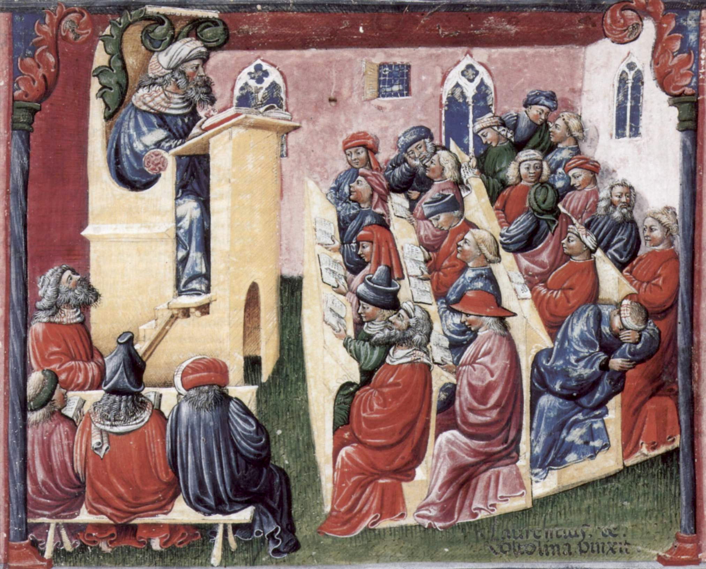

# Conceptual Continuity between Medieval and Early Modern Philosophy: Initiating a Computational History of Ideas (working title)

## The Idea

## Research Question

## What I have done so far

## What still needs to be done

## Challenges, Concerns, and Questions

## Directions for Future Research
The historical line drawn between medieval and (early) modern philosophy is only one example of the historians' tendency to divide the continuous development of philosophical thinking into distinct periods, each of them having a definite beginning and ending. Hence, future research could apply the method developed in here to other distinctions in the history of philosophy.

## Literature

1. **Background**

    * Dominik Perler, "What are Faculties of the Soul? Descartes and his Scholastic Background", in: John Marenbon, *Continuity and Innovation in Medieval and Modern Philosophy: Knowledge, Mind and Language*, Oxford, OUP, 2013.

    * Dominik Perler, "Classifying the Passions:	Descartes	and	His	Scholastic	Background",	in: Belgioioso & Carraud (eds.), *Les	passions	de l’âme*, Turnhout: Brepols	(forthcoming, maybe I can get a copy of the draft, if not, then the first reference should still be enough).

2. **René Descartes**

    * Meditationes de prima philosophia (esp. Med. IV & VI)
    * The Passions of the Soul (esp. Part I & II)
    * Principia Philosophiae (esp. Part I)
    * La Recherche de la Vérité (esp. Eluc. X)

3. **William of Ockham**

    * Quodlibeta Septem (esp. Part I & II, i.e. OT 9)
      - Engl. Transl.: Fredosso & Kelley, Quodlibeta Questions, Yales Uni. Press, *not* available for free as pdf/txt
    * Ordinatio (esp. Part I, i.e. OT 1)
    * Reportatio (esp. Part II & IV, i.e. OT 5 & 7)

4. **Francisco Suárez**

    * De Anima (DA, esp. Parts I & II)
      - Engl. transl.: Kranen & Reedy, Selections from De Anima (Disp. 1 & Disp. 2, Q. 3), Philosophia Verlag, *not* available for free as pdf/txt
    * Disputationes Metaphysicae (DM, esp. Part 12.2 & 18.5)
    * De actibus qui vocantur passiones (esp. I.3)
